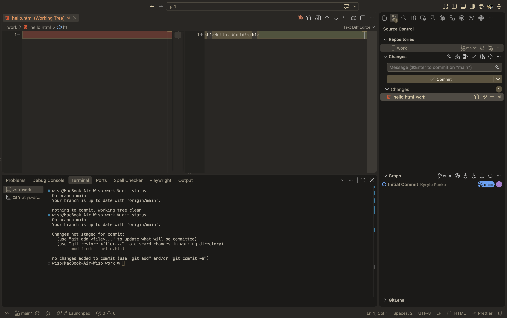
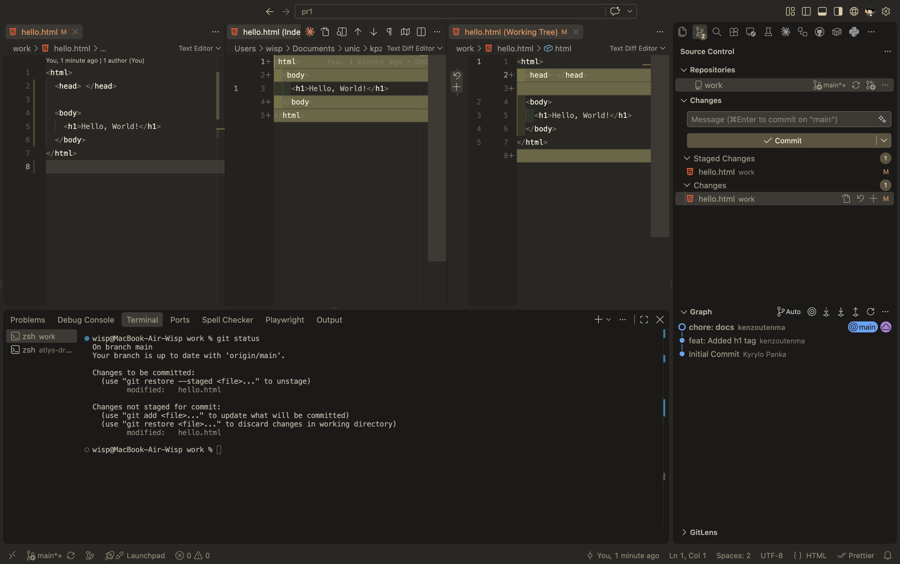
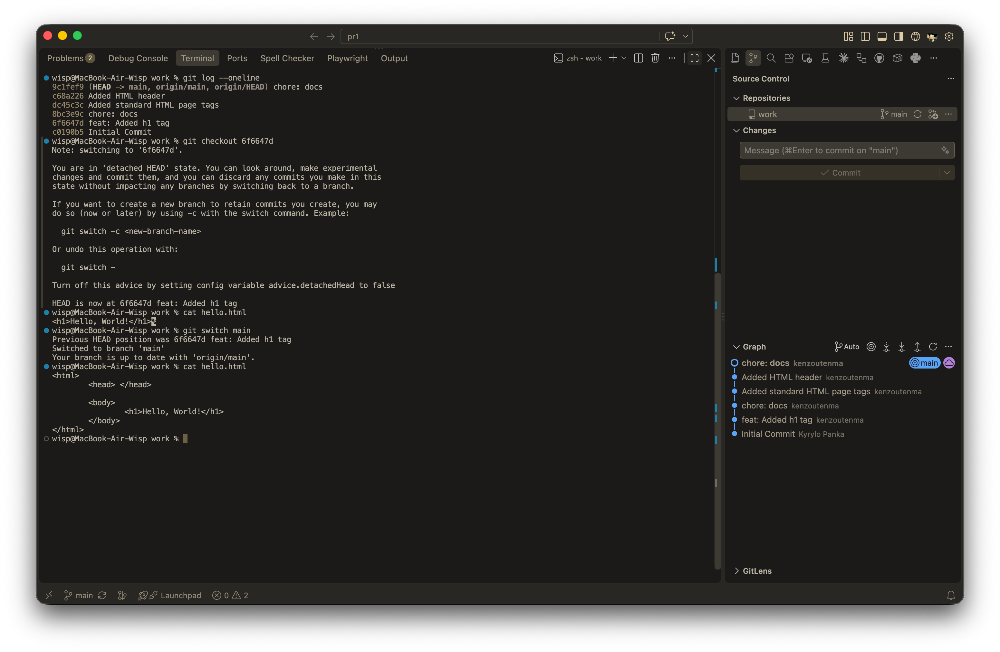
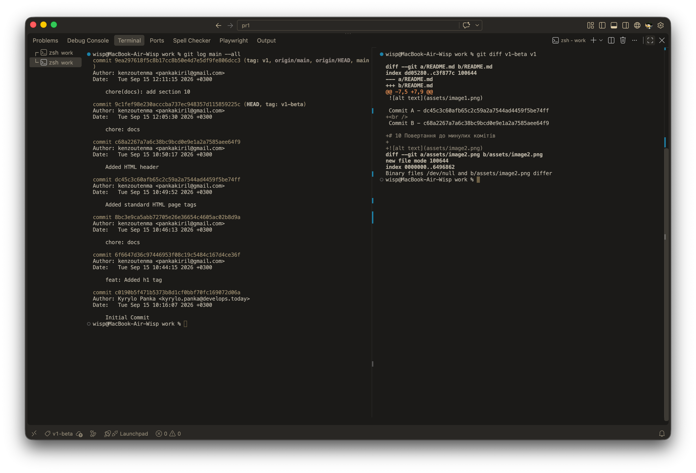
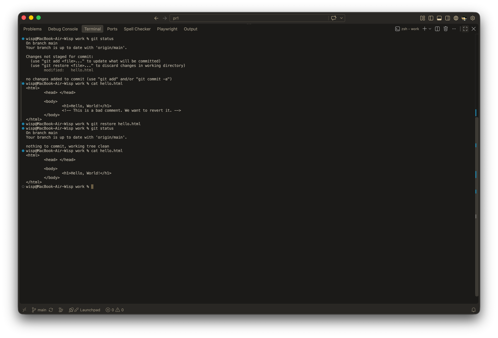
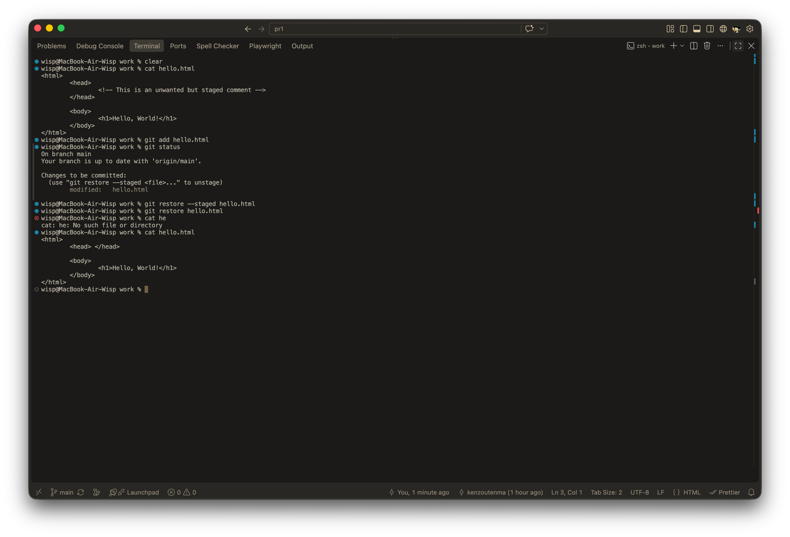
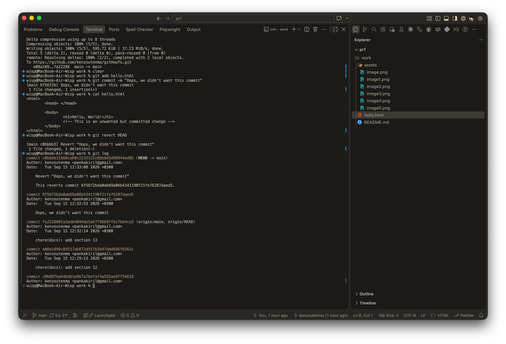
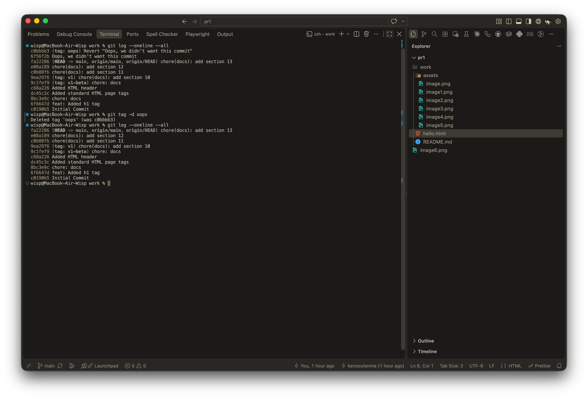

# 1-3 Створення репозиторію та перша зміна

# 8 Changes, not files (feat-by-feat commits)

Commit A - dc45c3c60afb65c2c59a2a7544ad4459f5be74ff
 
Commit B - c68a2267a7a6c38bc9bcd0e9e1a2a7585aee64f9

# 10 Повертання до минулих комітів

# 11 Тегування Версій

# 12 Скидання змін до стейджу

# 13 Скидання змін після стейджу

# 14-16 Revert. reset та видалення коміту

